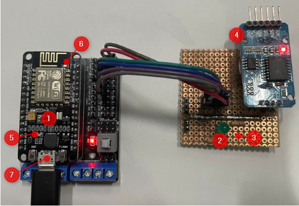
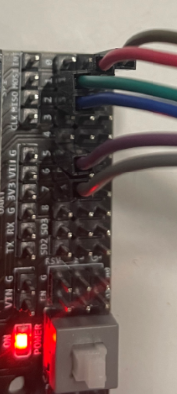
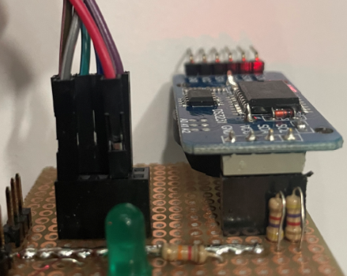
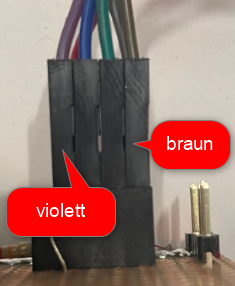

# WiFi-humidifier

## Anleitung
Wenn bereits Logindaten für das Netzwerk eingegeben wurden, zu Schritt 5 springen
1. Mit einem Gerät (PC oder Smartphone) mit dem AccessPoint `humi` mit dem Passwort `password` verbinden.
2. Im Browser die IP-Adresse `192.168.4.1` aufrufen.
3. Logindaten für das Netzwerk eingeben.
4. Gerät neustarten. Das Gerät sollte sich jetzt mit dem Heimnetzwerk verbinden.
5. Im Browser `wifi-humidifier.local` eingeben. Die folgende Webseite wird angezeigt.

6. Unter Settings kann die Zeit gesetzt werden.

## Hardware

1. NodeMCU, Controller inkl. WLAN-Modul
2. LED, simuliert Ausgang
3. Taster, gedrückt halten und einschalten, sobald die LED leuchtet sind die WLAN credentials gelöscht
4. DS3231, RTC-Modul
5. onBoard LED 1
6. onBoard LED 2
7. USB-mini Anschluss für Stromversorgung und Serielles Monitoring

### Verbindung

## Optimierungen
