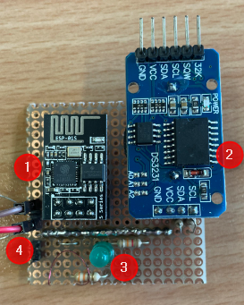

# WiFi-humidifier

## Anleitung
1. Im Ordner `include` eine Datei mit dem Namen `wifi_credentials.h`. Darin befinden sich die Credentials um sich mit dem Gerät zu verbinden, falls keine Credentials gespeichert sind und das Gerät in den AccessPoint-Modus geht. Die SSID und das Passwort können anpasst werden.
```c
#ifndef WIFI_CREDENTIALS_H
#define WIFI_CREDENTIALS_H

const char* ssid_ap = "ssid";      // set ssid
const char* pass_ap = "pass";      // set password

#endif // WIFI_CREDENTIALS_H
```
2. Programm auf den Controller laden
3. Die IP-Adresse des Controllers herausfinden. Am besten über den Router.
4. Die IP-Adresse des Controllers im Browser eingeben. Die folgende Webseite wird angezeigt.

5. Unter Settings kann die Zeit gesetzt werden.


Wenn die Logindaten für das Netzwerk gelöscht wurden oder noch nie eingegeben wurden, folgende Anleitung befolgen
1. Mit einem Gerät (PC oder Smartphone) mit dem AccessPoint verbinden. Die SSID und das Passwort sind in der Datei `wifi_credentials.h` zu finden.
2. Im Browser die IP-Adresse `192.168.4.1` aufrufen.
3. Logindaten für das Netzwerk eingeben.
4. Gerät neustarten. Das Gerät sollte sich jetzt mit dem Heimnetzwerk verbinden.

## Hardware

1. ESP01-S, Controller inkl. WLAN-Modul
2. DS3231, RTC-Modul
3. LED, simuliert Ausgang
4. Spannungsanschluss 3.3V

## Optimierungen
- `ESP8266mDNS`-Bibliothek verwenden, damit der Webserver über einen Namen aufgerufen werden kann
- NodeMCU (grösserer Controller mit mehr Pins) verwenden um den Controller bei Bedarf auch mit Hardware erweitern können
